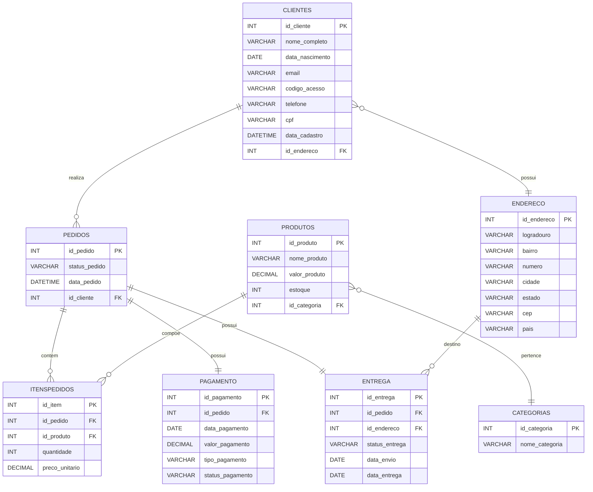

# Sistema de Vendas Online – Banco de Dados

Projeto de modelagem e implementação de um banco de dados relacional para um sistema de e-commerce.

A ideia foi simular o funcionamento de uma loja online completa, organizando clientes, produtos, pedidos, pagamentos e entregas com foco em estrutura e desempenho.

---

## Estrutura

O banco foi dividido nas principais entidades de um e-commerce:

- Clientes e Endereços  
- Produtos e Categorias  
- Pedidos e Itens de Pedido  
- Pagamento  
- Entrega  

---

## Diagrama (DER)


---

Tabelas principais:

- Endereco  
- Clientes  
- Categorias  
- Produtos  
- Pedidos  
- ItensPedidos  
- Pagamento  
- Entrega  

O modelo segue até a 3ª forma normal, evitando redundância e mantendo consistência.

---

## Como funciona

- Um cliente faz pedidos  
- Cada pedido pode ter vários produtos  
- Os itens do pedido fazem a ligação entre pedidos e produtos  
- Cada pedido possui pagamento e entrega  
- Produtos são organizados por categorias  

---

## Funcionalidades

- Inserção, consulta e atualização de dados  
- Consultas com JOIN entre múltiplas tabelas  
- Estrutura preparada para operações completas de CRUD  

---

## Views

Foram criadas views para facilitar consultas e análise:

- vw_PedidoDetalhado → pedidos com produtos e valores  
- vw_TotalGastoCliente → total gasto por cliente  
- vw_BaixoEstoque → produtos com pouco estoque  
- vw_PagamentoPendente → pagamentos não finalizados  

---

## Procedures e funções

- calcular_total_pedido  
- criar_pedido  
- relatorio_pedidos_cliente  
- atualizar_estoque  
- aplicar_desconto_produtos_caros  

Usadas para centralizar lógica e evitar repetição de código.

---

## Transações e integridade

- Uso de BEGIN, COMMIT e ROLLBACK  
- Controle de consistência dos dados  
- Isolamento com READ COMMITTED  

---

## Otimização

- Queries organizadas com joins eficientes  
- Uso de views para reduzir repetição  
- Estrutura pensada para performance  

---

## Controle de acesso

Papéis definidos para diferentes áreas:

- Administração  
- Estoque  
- Vendas  
- Financeiro  
- Logística  
- Atendimento  

---

## Exemplo de consulta

```sql
SELECT *
FROM vw_PedidoDetalhado
ORDER BY id_pedido, nome_produto;

SELECT nome_completo, total_gasto
FROM vw_TotalGastoCliente
WHERE total_gasto > 100
ORDER BY total_gasto DESC;
